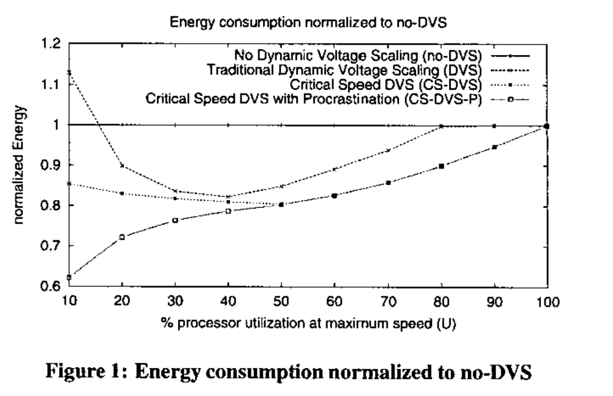
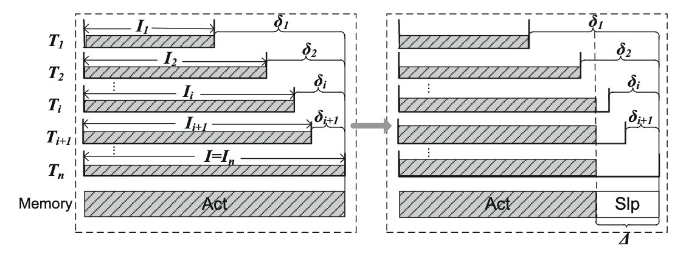
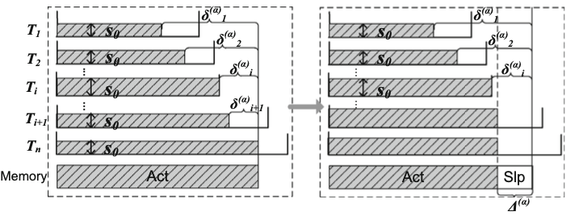

# DVFS Memory Model and Algorithm

## SCP (single DVS core processor) and a single memory

[Memory-DVS-System-2004-Embedded](../SCP/SCP-AM-2004-California_Jejurikar-Memory-DVS-System-Embedded.pdf)

Ref: R. Jejurikar, R. Gupta, Dynamic voltage scaling for system-wide energy minimization in real-time embedded systems, in: Proceedings of the International Symposium on Low Power Electronics and Design (ISLPED), 2004, pp. 78–81.

#### System Model

- A task set of n periodic real time tasks $\Gamma = \{\tau_1,...\tau_n\}$
- For each task $\tau_i$,

  - The period of the task $T_i$
  - The relative deadline of the task $D_i$
  - $$
    T_i = D_i
    $$
  - The worst case execution cycles of the task at the maximum processor speed $C_i$
- All tasks are scheduled by the Earliest Deadline First (EDF) scheduling policy.
- All tasks are assumed to be independent and preemptive.
- A task is procrastinated (or delayed) if the processor remains idle despite the presence of the task in the processor ready queue.
- Processors support variable voltage and frequency levels for energy efficient operation of the system.

  - The available frequencies be {f1 , ...,fn}, in increasing order of frequency
  - The corresponding voltage levels be {v1, ...,vs}
  - A slowdown factor $\eta_i$

    - the normalized operating frequency
    - the ratio of the current frequency to the maximum frequency, fs, of the processor.
    - $$
      \eta_i \in (\frac{f_1}{f_s},\frac{f_2}{f_s},...,\frac{f_n}{f_s}) \sqsubseteq [0,1]
      $$
    - Task level slowdown as opposed to intra-task slowdown.
    - Explicitly, $\eta_i^{k}$ when task $\tau_i$ is assigned a slowdown factor $\frac{f_k}{f_s}$
  - Power consumption P(CPU,$\eta$)
  - The processor is said to be idle if it is not executing a task.

    - Support shutdown to reduce the leakage power consumption.
    - In the idle state, the processor could be in the shutdown state (no leakage) or in the standby state (active + idle) where leakage power is dissipated.
- A set of m resources (peripheral devices) $\R = {R_1,....R_m}$.

  - Each task $\tau_i$ uses a subset of the resources in R, denoted as $\R^{\tau_i}$
  - Standby state if it is on (active) but idle.
  - Power consumption P($R_i$), where shutdown power of the resource = 0.
  - Assume that the device $R_j$ standby time for each task $\tau_i$ is expressed in number of processor cycles $C_i^{R_j}$. ( especially for compiler directed DPM policies).
  - If a task doesn't use $R_j$, then  $C_i^{R_j}=0$

#### Goal

Consider task slowdown factors that minimize the total system energy consumption including the resource standby energy consumption.

Not DPM policies, but consider standby energy in computing static slowdown factors.

#### Energy consumption considering standby resources

Task $\tau_i$ is executed at a speed $\eta$

$$
E_i(\eta)= \frac{C_i}{\eta} P(CPU,\eta) + \sum_{R_j\in\R^{\tau_i}} \frac{C_i^{R_j}}{\eta} P(R_j)
$$

Optimization problem

$$
minimize \quad \sum_i \frac{E_i(\eta)}{T_i}
$$

Subject to: [Feasibility]

$$
\sum_i \frac{C_i}{\eta_i} \leq \sum_i {T_i}
$$

The slowdown factor for a task that minimizes its total energy consumption, called the *critical speed* for the task.

#### Heuristic Algorithm

We compute the energy consumption of each task at all possible discrete slowdown factors.

- compute the critical speed for each task.
- increase the task slowdown factors if the task set is not feasible.

A heuristic to select a task whose speed is increased. We increase the slowdown of a task that results in the
minimum energy increase per unit time.

The current slowdown factor of a candidate task $\tau_i$ is $\eta_i^k$; the next higher factor is $\eta_i^{k+1}$.

$$
\Delta E_i = E_i(\eta_i^{k+1})- E_i(\eta_i^{k})
$$

Speedup

$$
\Delta t_i = C_i (\frac {1}{\eta_i^k}-\frac{1}{\eta_i^{k+1}})
$$

Find the candidate task with the minimum value of $\frac{\Delta E_i}{\Delta t_i}$

[Procrastination-DVS-System-2004-Embedded](../SCP/SCP-AM-2004-California_Jejurikar-Procrastination-DVS-System-Embedded.pdf)

---- Appendix -----

Maximizing the time period of sleep mode (which can be seen as a low power state, e.g., the power-down state and low refresh rate, when the memory is not accessed)

- Nevertheless, we should note that most previous research works either consider optimizing a single power consumption (i.e., multi-core processor power or memory power) or focus on the problem with the system provisioning single-core processor and memory.
- They first showed that the problem is NP-hard if the number of cores is fewer than the number of tasks (and the number of cores is at least 2). Thus, to avoid facing the NP-hardness for the feasibility of the problem, they then turned their attention to the case when the number of cores is unbounded where several optimal solutions are proposed regarding different task models.

[19] J. Zhuo, C. Chakrabarti, System-level energy-efficient dynamic task scheduling, in: Proceedings of the Annual Design Automation Conference (DAC),2005, pp. 628–631.

[20] X. Zhong, C.-Z. Xu, System-wide energy minimization for real-time tasks: lower bound and approximation, ACM Trans. Embed. Comput. Syst. 7 (3) (2008) 28:1–28:24.

[21] X. Zhong, C.-Z. Xu, Frequency-aware energy optimization for real-time periodic and aperiodic tasks, in: Proceedings of the ACM SIGPLAN/SIGBED International Conference on Languages, Compilers, and Tools for Embedded Systems (LCTES), 2007, pp. 21–30.

## SMP and the shared main memory

Sleep and DVS-aware system-wide Energy Minimization (SDEM) problem

A cluster with multiple processor cores, which can share the heavy workload to speed up the task executions. In such architecture, the main memory is usually shared among multiple processor cores.

 [SMP-AM-2017-Energy-Idle](../SMP/SMP-AM-2017-UniChina_Chau-Energy-Idle.pdf)
Ref: Race to idle or not: balancing the memory sleep time with DVS for energy minimization

#### Model

- Sleep time of the shared memory is determined by **the common idle time** of all the cores.
- The static power for the shared main memory is denoted by $\alpha_m$, due to the leakage current.
- Break-even time $\xi$

  - Models transition energy overhead
  - the length of the time interval where *the memory working in the idle but active mode* **consumes the same energy** as *the transition overhead*
- Each core has disjont memory area.
- The number of cores C, the number of tasks n
- Bounded number of cores when $C < n$

  - NP-hard (reduced from 3-Partition and Multi-Partition)
- When the number of cores is unbounded $C\geq n$, where cores have negligible and non-negligible static power (two cases)

  - for tasks with common release time
    - optimal schemes are proposed for two cases respectively $O(nlogn), O(n^2)$

- for agreeable deadline tasks (where later release time implies a later deadline)

  - two DP-based (Dynamic Programming) optimal solutions are developed respectively. $O(n^4+n^2), O(n^5+n^2 )$
- The general task model

  - An **online heuristic algorithm** is proposed.
  - When a new task Ti arrives, run the algorithm, and set all unfinished tasks’ release times the same as that of Ti . By applying the scheme presented in Sect. 4.1 (Sect. 4.2), the local optimal solution can be obtained for the current tasks. Keep the memory in the sleep state until a new task arrives or some task has to be executed to guarantee the local optimality.
- The energy overhead caused by mode transitions between active and sleep modes of the memory and the cores are further considered. With the transition overhead, the corresponding schemes over different models are presented.

**When the number of tasks is more than the number of cores** (NP-hard)

 [SMP-A-2021-Energy-SharedMemory](../SMP/SMP-A-2021-UniChina_Chau-Energy-SharedMemory.pdf)
Ref: Minimizing energy on homogeneous processors with shared memory

- When there is a single-core, we present the optimal algorithm ( a polynomial-time approximation algorithm with guaranteed performance ).
- Extend the intuition to the multi-core case, where the problem is tackled in two steps:
  - Present an optimal polynomial-time algorithm when the assignment of tasks to cores is given;
  - Propose an algorithm to assign tasks to cores, and show that it is a constant approximation algorithm.

[SCP-AM-2018-China_Wu-cache](../SCP/SCP-AM-2018-China_Wu-cache.pdf)

W. Wu, M. Li, K. Wang, H. Huang, E. Chen, Speed scaling problems with memory/cache consideration, J. Sched. 21 (6) (2018) 633–646.

- For the uniform with-cache model with agreeable jobs (later-released jobs do not have earlier deadlines), $O(n^4)$ and the approximation algorithm.