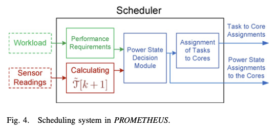

<!-- Draft version by Peter HU -->

## DVFS Thermal Model and Algorithm

- Uniform / Variable Frequency Setting

  - Uniform: the operating frequencies of all the cores are the same. For such systems, when DFS is applied, the core frequencies are varied uniformly.

### [Pro-Temp] Temperature Control in 2008

[SMP-Temperature_Control_Using_Convex_Optimization](../SMP/SMP-AM-2008-Joint_Murali-Temperature_Control_Using_Convex_Optimization.pdf)

Ref: S. Murali et al., “Temperature control of high-performance multi-core platforms using convex optimization,” in Proc. of DATE, 2008.

- Temperature control techniques for homogeneous multicore systems (SMP) through DVFS
- To proactively **vary the frequencies of the cores** instead of setting them as the average speed.

### Details of the design

  **1st phase [Design-Time]**

- to obtain the set of feasible frequencies for the cores for different temperature and workload constraints

Denote

| Core 1        | ...... | Core i        | ..... | Core j | ..... | Core n        |
| ------------- | ------ | ------------- | ----- | ------ | ----- | ------------- |
| Power-$p_1$ | .....  | Power-$p_i$ |       |        |       | Power-$p_n$ |

- The power consumption of a core i  := $ p_i$

  - obtained by quadratically scaling the power consumption of the processors at f_max.

  $$
  p \propto f ^2
  $$

  - $$
    p_i = p_{max} \frac{f_i^2}{f_{max}^2}
    $$
- The set of cores that are adjacent to a core i :=  Adj_i
- The proportionality constants ai,j and bi are based on the thermal behavior of the chip.

  - to get them, using finite element simulations or a thermal modeling framework like Hotspot
- The number of time-steps needed for thermal calculations := m

#### Compact Model in Thermal-design

There exists a well-known duality [Krum 2000]. The rationale behind is that current and heat flow are described by exactly the same differential equations for a potential difference.

This duality provides a convenient basis for an architecture-level thermal model. For a microarchitectural unit, heat conduction to the thermal package and to neighboring units are the dominant mechanisms that determine the temperature.

| Heat Transfer                                            | Electrical Phenomena                      |
| -------------------------------------------------------- | ------------------------------------------ |
| Heat flow passing through a thermal resistance           | Current passing through a resistance       |
| Heat:$Q$                                               | Charge:$q$                               |
| Temperature Difference:$ \Delta T$                     | Voltage:$V$                              |
| Thermal capacitance:$ C_t =\frac{\Delta Q}{\Delta T} $ | Capacitance:$C =\frac{q}{V} $            |
| $   R C_t  \frac{d T(t)}{dt} +T(t) = R P(t) $          | $   R C \frac {d V(t)}{dt} +V(t) = V_I $ |

Explanation:

- Heat flow can be described as a “current” passing through a thermal resistance, leading to a temperature difference analogous to a “voltage.”
- Thermal capacitance is also necessary for modeling transient behavior, to capture the time required for a mass to change temperature and hence to account for the delay before a change in power results in the temperature’s reaching steady state.

  - Lumped values of thermal R and C can be computed to represent the heat flow among regions of a chip and from each region to the thermal package.
  - The thermal Rs and Cs together lead to exponential rise and fall times characterized by thermal RC time constants analogous to the electrical RC time constants.
  - These equivalent circuits are called compact models and dynamic compact models if they include thermal capacitors

[2]  K. Skadron, M. Stan, W. Huang, S. Velusamy, K. Sankaranarayanan and D. Tarjan, “Temperature-aware microarchitecture: Modeling and implementation,” ACM Trans. Archit. Code Optim., vol. 1, no. 1, pp. 94–125, Mar. 2004.

#### Thermal Equation

We discretize the equation above assuming a sampling period of Ts seconds.

The thermal equation of core i at current time (k+1) is based on the previous one timestamp (k).

$$
t_i ' = t_i + \sum_{\forall j \in Adj_i} a_{i,j} (t_j - t_i) + b_i p_i
$$

Need to be smaller than maximum allowable temperature := t_max

$$
s.t.   \quad t_i' \leq t_{max}\quad (\forall i, timestamp_k)
$$

- Starting value (k=0) of the thermal equation := t_start.
- The target operating frequency of the cores that need to meet  := f_target
- The frequency of operation of core i := $f_i \geq 0$

  $$
  s.t. \quad \frac {\sum_i f_i}{n} \geq f_{target}
  $$

**Temperature Gradients**

a **[physical quantity](https://en.wikipedia.org/wiki/Physical_quantity "Physical quantity") that describes in which direction and at what rate the** [temperature](https://en.wikipedia.org/wiki/Temperature "Temperature") changes the most rapidly around a particular location.

Assumption: Uniform spatial temperature gradients across the cores

$$
t_i - t_j \leq tgrad \quad (\forall i,j)
$$

#### Objective

Find a vector $f_i \geq 0$ that satisfies the above restrictions and

$$
min \quad \sum_i p_i  + tgrad
$$

$$
min \quad \sum_i  p_{max} \frac{f_i^2}{f_{max}^2} + tgrad
$$

Solving convex optimization models

- using interior point methods [Non-Linear w.r.t $f_i$]
- polynomial time complexity (in the number of variables and constraints)

#### Design Time Implementation

We use the execution characteristics of tasks from a mix of different benchmarks, ranging from web-accessing to playing multimedia files [26]. The maximum task/thread lengths of the benchmarks is around 10 ms. The experiments are conducted using a large trace with around 60,000 tasks, modeling several hundredseconds of actual system execution.

**2nd phase [Run-Time]**

- The Thermal Management Unit
- tracks
  - the utilization and temperature information of the different processors
  - workload of the tasks waiting in the task queue
- calculates the required average operating frequency across all the processors for the next period.
- chooses the frequency assignment for the processors from the table.
  - If the frequency point cannot be supported, the unit chooses the next lower frequency point in the table that can support the temperature constraints.

#### Effects

With the integration of the efficient task assignment policy with our Pro-Temp method, the spatial temperature difference across the cores reducesfurther (by 16%).

### Variable Frequency Setting considering floorplan of the chip

The processors near the cooler caches ( compare with near other hotter processors )

- can more easily dissipate their heat than the other processors.
- can be set at a larger frequency.

  -----  Appendix : List of related literature ----

#### [Related] Temperature aware task scheduling and migration techniques

[13] A. K. Coskun, J. L. Ayala, D. Atienza, T. S. Rosing, and Y. Leblebici, “Dynamic thermal management in 3d multicore architectures,” in Proc. of DATE, 2009.

[14] V. Hanumaiah, S. Vrudhula, and K. S. Chatha, “Performance optimal online dvfs and task migration techniques for thermally constrained multi-core processors,” IEEE Trans on CAD of Integrated Circuits and Syst., vol. 30, no. 11, pp. 1677–1690, 2011.

#### [Related]  Model predictive and optimal control theory employed for thermal management to achieve smooth control with minimal performance loss

[15] F. Zanini, D. Atienza, L. Benini, and G. De Micheli, “Multicore thermal management with model predictive control,” in European Conf. on Circuit Theory and Design, 2009.

[16] Y. Wang, K. Ma, and X. Wang, “Temperature-constrained power control for chip multiprocessors with online model estimation,” in AC M SIGARCH Comp. Arch. News, vol. 37, no. 3, 2009, pp. 314–324.

#### [Related] Others

Agent [17] M.A.AlFaruque,J.Jahn,T.Ebi,andJ.Henkel,“Runtimethermalmanagement using software agents for multi-and many-core architectures,”IEEE Design & Test of Computers, vol. 27(6), pp. 58–68, 2010.

[4] T. S. Muthukaruppan et al., “Hierarchical power management for asymmetric multi-core in dark silicon era,” in Proc. of DAC, 2013.

    -----  Appendix : List of related literature ----

### [PROMETHEUS-framework] Thermal Power in HMP Embedded

[Proactive_Method_for_Thermal](../HMP/Thermal/HMP-AM-2013-USA_Sharifi-Proactive_Method_for_Thermal.pdf)

Ref: PROMETHEUS: A Proactive Method for Thermal Management of Heterogeneous MPSoCs, Shervin Sharifi, Member, IEEE, Dilip Krishnaswamy, Senior Member, IEEE, and Tajana Sˇimunic ́ Rosing, Member, IEEE

#### Thermal Model

- consider various performance, power, and thermal characteristics for cores
- Same compact model $   R C_t  \frac{d T(t)}{dt} +T(t) = R P(t) $, with analytical solution to the non-homogeneous system of differential equations.

- Lack of thermal information of internal nodes : break the vector of temperature values (T) into two subvectors.
- Good news: F_u doesn't change quickly! Assumption: Fu[k + 1] ≈ Fu[k]
  - Subvector To represents *observable nodes* by thermal sensors (core temperatures)
  - Subvector Tu represents the internal nodes whose temperatures are *unobservable*

- $$
  T_o[k + 1] = \Psi_{oo}T_o[k] + \Psi_{uo}T_u[k] +  \Phi_{oo}P[k + 1]
  $$

  $$
  T_o[k + 1] = F_o+F_u+F_p
  $$
- Consider the difference between time k and k+1, T_u can be eliminated.
- $$
  T_o[k+1] = (\Psi_{oo} +I)T_o[k]−\Psi_{oo}T_o[k−1]+\Phi_{oo}(P[k+1]−P[k]).
  $$
- Incorporate the leakage power and its temperature dependence $Pleak(t) = LT(t) + Q$

  - Linear approximation of the leakage as suggested in [13] with an approximate estimation error of up to 5%
  - L is a diagonal matrix containing the coefficients for the linear terms and Q is a vector of constant terms for different cores.

#### Proactive Temperature Aware Scheduling

- guarantees that the maximum temperature threshold will not be exceeded.
- can be applied to any preemptive, multitasking scheduling system that is able to preempt the tasks or migrate them to other cores at scheduling intervals.

**Power State Decision Modules**

Two scheduling techniques

- TempoMP

  - determines the safe power states based on an optimization stage that is performed offline and its results are stored for runtime use. Although the optimization technique can provide locally optimal power state decisions, storing and fetching the optimization results incurs overhead.
- TemPromp

  - To avoid this overhead of storing and retreiving, use a heuristic for its power state decision module.

### Multi-parametric programming

Multiparametric optimization approach splits the optimization process into offline and online stages. We describe how we deal with the general case of systems with **multiple cores** and different representation of performance requirements.

- $\Omega$ := The core type
- Power states for each type of the cores

  $$
  \alpha_{n,v} = 1 \quad iff.  core_n-is-set-to-Power-state_v
  $$

the Varying Parameters (Inputs)

- Performance Requirements
  $$
  s.t. \quad \forall \Omega,v:  number-of-cores-used \sum_\Omega -\alpha_{w,v} \geq   minimum-number-of-cores -\sigma_{\Omega,v}
  $$
- the Thermal State of the MPSoC

$$
s.t. \quad T(\alpha[k+1],\alpha[k],T_o[k+1])< T_{Threshold}
$$

#### Objective

$$
min_\alpha  \quad  P_{total}(\alpha[k+1],T_o[k+1])
$$

#### TempoMP

- Instead of solving the optimization problem at each scheduling tick, use multiparametric programming, the optimization problem is solved offline.
  - The set of critical regions (one-to-one mapping) and parametric solutions are provided as output.
  - Memory required for the critical regions of the MPSoC of Fig. 7 is less than 500 KB.

- No optimization needs to be done at runtime. Only a limited number of operations need to be performed at runtime in order to find the critical regions corresponding to the current solution.

  - Then the Fr values are used to find the proper region within this set. If nr is the average number of regions in each set of regions (nr < 5 in our experiments) and nc is the number of the cores, then finding the right region within a set needs nr × nc multiply/add operations on average[17].
  - Therefore, the complexity of this algorithm is $O(nr × nc )$.

#### TemPromp

To avoid this overhead of storing and retreiving, use a heuristic for its power state decision module.

- Sorting the core types in the decreasing order of their performance (average IPS).    $O(n_c log(n_c))$
- Sort the set of cores with the same type in increasing order of the cores’ Ti[k + 1]
- Checks the instances of each type of cores in the increasing order of T [k + 1].  $O(n_c)$
- Core i is set to the lower of p_req and **p_safe** ($T_o[k+1]< T_{Threshold}$) to provide just enough performance for the workload and not to exceed the temperature threshold.

#### Task Assignment to the cores

- make sure that the task with the highest performance requirement (earliest ddl) is provided with the highest performance  core (at the highest power state) available.
- the algorithm always finishes because at each iteration it assigns a task to an available core and finishes when no core or no task is left.
- using a binary heap, no sorting is necessary for the tasks
- Complexity: $O(max (n_r×n_c, n_t, n_c log(n_t) )$

### [DTPM] Thermal Power in HMP Mobile

  [HMP-AM-2015-USA_Singla-Thermal_Power-Mobile](../HMP/Thermal/HMP-AM-2015-USA_Singla-Thermal_Power.pdf)

  Ref: Predictive_dynamic_thermal_and_power_management_for_heterogeneous_mobile_platforms, 2015

#### DTPM

Linux implementation of DTPM: please refer to [DTPM Linux](https://docs.kernel.org/power/powercap/dtpm.html)

The proposed DTPM approach is **non-intrusive** when the temperature is within permissible levels (i.e. when Thermal Violation == NO).

#### Power and Thermal Models

with experimental validation using one of the first commercial big.LITTLE architectures (Samsung Exynos 5410 octa-core chip).

Compute power budget using temperature prediction

Thermal Equation also enables temperature prediction at an arbitrary number of time steps $ t_i^{n}$ ahead. In particular, the temperature at time step k + n can be derived.

$$
t_i ' = t_i + \sum_{\forall j \in Adj_i} a_{i,j} (t_j - t_i) + b_i p_i
$$

$$
t_i '' = t_i' + \sum_{\forall j \in Adj_i} a_{i,j} (t_j' - t'_i) + b_i p'_i
$$

- Prediction interval

A prediction interval of “1s” since it is sufficient to control the temperature of our target platform. In general, accurate predictions up to“5s” can be made.

#### Algorithm

- If the predicted temperature exceeds the specified constraint for any one of the hotspots, the power budget is computed, as explained in Section V-B.
- To minimize the impact on performance, the pro-posed algorithm
  - First finds the maximum feasible frequencies under the available power budget.
  - If the power budget cannotbe met with the current number of active cores, then the hottest core is put to sleep, and the tasks running on this core aremigrated to the other cores by the kernel.
  - Finally, when the power budget is so small that it cannot be satisfied even witha single big core, then all the active tasks are migrated to the little cluster and big cores are put to sleep.
  - Moving to the little cluster and reducing the GPU frequency (if GPU is active) are used as the last resort,
    - since they have the biggest performance impact and the migrating across clusters has a larger overhead based on our empirical evaluations.

#### Effects

Exhaustive experimental evaluation which demonstrates effective thermal regulation with 6× smaller variance and as much as 16% reduction in total platform power.

In particular, it regulates the temperature more effectively than the default configuration which uses a fan, and on average offers 10% platform power savings with 3.3% **loss** in performance.

### Appendix: TO DO

  [HMP-AM-2017-Bhat-Thermal_Power](../HMP/Thermal/HMP-AM-2017-Bhat-Thermal_Power.pdf)

  Ref: Algorithmic Optimization of Thermal and Power Management for Heterogeneous Mobile Platforms, 2017

  [HMP-AM-2017-Pakistan_Khan-Thermal_Power](../HMP/Thermal/HMP-AM-2017-Pakistan_Khan-Thermal_Power.pdf)

  Ref: Scheduling_based_energy_optimization_technique_in_multiprocessor_embedded_systems
