<!-- Draft version by Peter HU -->

## Single Core Processor (SCP) DVFS

Math Model and Algorithm Design

## Continuous Speed Model in 1995

Start from 1995 with a single processor.

1. [SCP-AM-1995-PARC_Yao-DVS-Continuous](../SCP/SCP-AM-1995-PARC_Yao-DVS-Continuous.pdf) : First to give a polynomial-time algorithm to compute an optimal schedule in $O(n^3)$; Main benchmark for evaluating other scheduling algorithms.

  F. Yao, A. Demers, S. Shenker, A scheduling model for reduced CPU energy, in: Proceedings of IEEE Annual Symposium on Foundations of Computer Science (FOCS), 1995, pp. 374–382.

## Model

- The energy minimization problem of scheduling n tasks with release times and deadlines on a single-core processor that can vary its speed dynamically where preemption is allowed.

See Section 2 for details

## Power Consumption Function

- Only assumption added is

  - convexity on processor speed.
  - realistic since energy consumption is at least a quadratic function of the supply voltage (hence CPU speed)
- Power Consumption depends on processor's speed $s$:

$$
P(s) = s^{p} , p \geq 2
$$

- Energy consumption:

$$
E(S)=\int_t P(s(t)) dt
$$

    - A schedule is a pair S = (s,job) of functions defined over [t0,t1]
    - 1. Non-negative s(t) is the processor speed at time t.
    - 2. job(t) defines the job being executed or idle ( if s(t)=0 ) at time t.

- Thus the lower bound on the average processing speed (intensity of jobs) is the optimal Energy consumption.

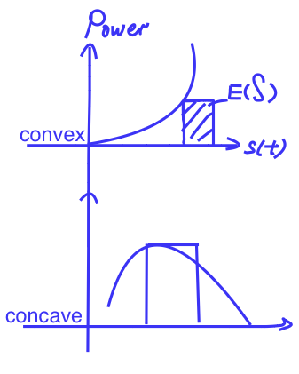

## Average Rate or Density

$R_j$ is job's required number of CPU cycles.
Each job j average-rate is

$$
d_j =   \frac{R_j} {b_j-a_j}
$$

Start time a_j, deadline b_j.

## Critical Interval

Given a job set J

- an interval in which a group of jobs run at maximum constant-speed in any optimal schedule for J.
- Intensity of an interval I = [z,z']
  $$
  g(I) = \sum \frac{R_j} {z'-z}
  $$

## Earliest Deadline First

At any time t, among jobs $j_k$ that are available for execution, that is,

- $j_k$ satisfying $t ∈ [a_k,b_k)$
- $j_k$ not yet finished by t.

It is the job with minimum deadline $b_k$ that will be executed during [t, t + ε].

In EDF, we assume the jobs in J = {j1, . . . , jn} are indexed by their deadlines.

## Offline Algorithm: Divide and Conquer

    Repeat the following steps until J is empty:
        1. Identify a critical interval I* = [ z ,z’] by computing s = max g(I),
        2. Schedule the jobs of J_I* at speed s over interval I*
        by the Earliest Deadline policy
        (which is always feasible, see C. Liu and J. Layland. Scheduling algorithms for multiprogramming in a hard real-time environment. CACM 20 (l),46-61, 1973.).
        3. Update the subproblem
        J -= J_I*;   // reflect the deletion of jobs J_I*
        for all job j in J:
        // reset other jobs' deadline to reflect deletion of interval I*
            if bj ∈ [z,z’]:
                b_j := z
            else if b_j >= z':
                b_j -= (z'-z)
        similarly, reset the arrival times

Define $|J| = n$.
Complexity:  $O(n^2)$ or $O(n log^2 n)$ using segment tree.

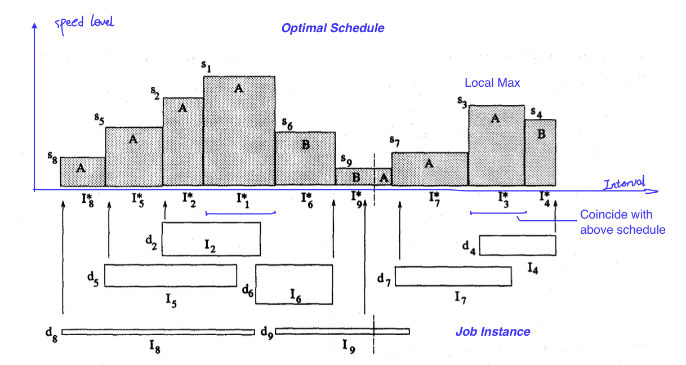

Step-by-Step Walk-Through of the algorithm

    s1=d1 max speed in J ----- Critical Interval I*=[a1,b1]
      Schedule the jobs of J_1 by Earliest Deadline Policy.
      Here only J1 is involved.
      Reset J -= J_1, update J2, J5, J6 and J8 time interval.

    s2=d2 max speed in J ----- Critical Interval I*=[a2,b2]
      Schedule the jobs of J_1 by Earliest Deadline Policy.
      Here only J1 is involved.
      Reset J -= J_2, update J5 and J8 time interval.

    s3=d3 max speed in J' ----- Critical Interval I*=[a3,b3]
      Schedule the jobs of J_3 by Earliest Deadline Policy.
      Here only J3 is involved.
      Reset J -= J_3, update other jobs' time interval.

    d6, d2, d4 ..
      (sorted by the height di, reflecting the average rate needed for the job to be done within deadline.)

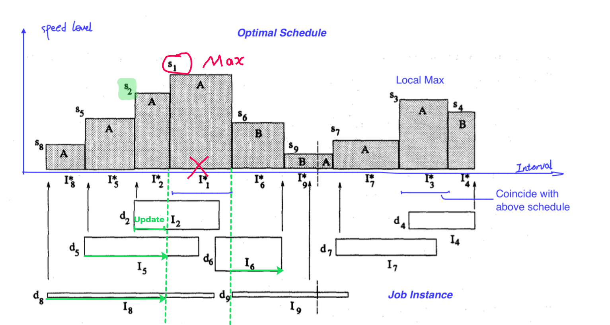

## Online Algorithm

### Heuristics

[Average Rate Heuristics]After each arrival time t, recompute an optimal schedule for the problem instance,

- Consist of the newly arrived job and the remaining portions of all other available jobs.
- Thus, the recomputation is done for a set of jobs all having the same arrival time.

[Optimal Available Heuristic]

- Set the processor speed at time t at

$$
s(t)=\sum_j d_j
$$

- Use the earliest-deadline policy to choose among available jobs.

#### Competitive Ratio

The competitive ratio of an online algorithm for an optimization problem is

- the approximation ratio achieved by the algorithm,
- i.e., the worst-case ratio between the cost of the solution found by the algorithm and the cost of an optimal solution.
- = $\frac {cost(solution-found)}{cost( an-optimal-solution)} = A VR(J)/OPT(J)$

#### Example

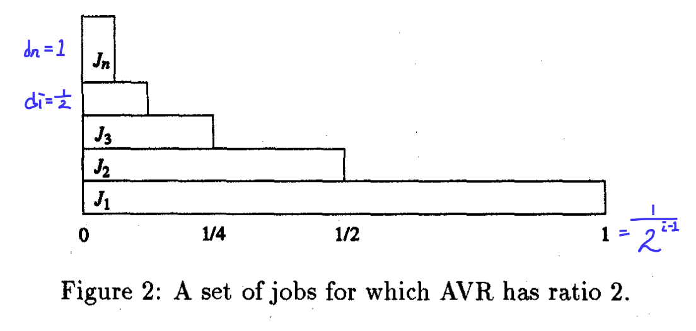
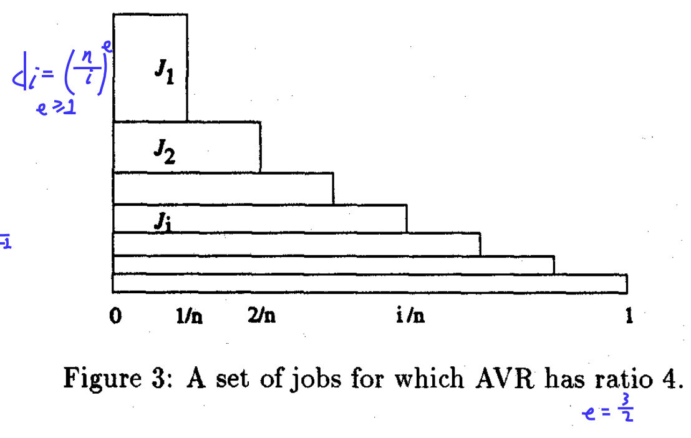

We also conjecture that

- 4 is the exact value of its competitive ratio.

We prove
For the power function $P ( s ) = s^2$, the Average Rate Heuristic has competitive ratio r where 4<r<8.

Details: Section 5, Analysis of AVR

## Discrete Speed Model via Translation from the above continuous model

2. [SCP-AM-2005-Samsung_Kwon-DVS](../SCP/SCP-AM-2005-Samsung_Kwon-DVS.pdf): $O(n^3)$, same as the continuous algorithm.

Ref:  Kwon, W. & Kim, T. (2005) ACM Trans. Embedded Computing Systems 4, 211–230.

- construct the optimal continuous schedule
- individually adjust the ‘‘ideal’’ speed of each job by mapping it to the nearest higher and lower speed levels.
- The complexity of such an algorithm is thus the same as the continuous algorithm.

## Improvements in 2005

### Discrete Speed Model ( Time Complexity ⬇ )

 [SCP-AM-2005-Tsinghua_Li-Energy-DVS-Discrete](../SCP/SCP-AM-2005-Tsinghua_Li-Energy-DVS-Discrete.pdf): Discrete model, $O(d n logn)$ [Optimal], where d := # speed levels.

Li, M. & Yao, F. F. (2005) SIAM J. Computing 35, 658–671.

### Model

d := discrete voltage levels
The clock speeds s1 > s2 > ··· > sd.

Assumption:

- Only these speeds are available for job execution
- The highest speed s1 is fast enough to guarantee a feasible schedule for the given jobs.
- Otherwise, it provides an unfeasible schedule

Goal

- find a schedule that consumes as little energy as possible.

### s-schedule

For any constant s, the s-schedule for J is

- an EDF schedule that uses constant speed s in executing any jobs of J.
- it may have idle periods or unfinished jobs in general.
- provide useful information regarding the optimal speed function for J without explicitly computing it.

### Algorithm Design

[Stage1-1](#algorithm-stage-1-1-s-schedule-computed-in-on-logn)[Stage1-2](#algorithm-stage-1-2)

- In stage 1, the jobs in J are partitioned into d disjoint groups via s-schedules
  - Ji consists of all jobs whose execution speeds in the continuous optimal schedule S_opt lie between si and si+1.
  - $O(nlogn)$ per group.

[Stage2](#algorithm-stage-2-two-level-schedule)

- In stage 2, Schedule jobs in Ji using two-level speed si and si+1.
  - $O(nlogn)$ per group.

Hence this two-stage algorithm yields an optimal discrete voltage schedule for J in total time O(dn log n).

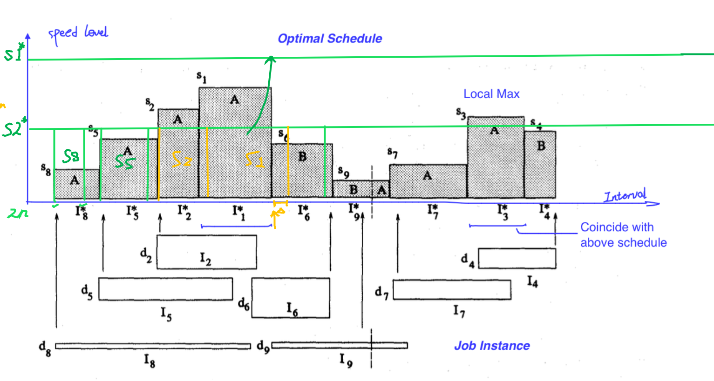

### Algorithm Details

### (s-)Execution Interval

a maximal subinterval of [0,1] when executing the same job jk (regarding S).

$I_k(S)$ the collection of all execution intervals for jk with respect to S.
Here, $I_k^s$ all s-execution intervals for job jk.

EDF ordering

- we assume the jobs in J = {j1, . . . , jn} are indexed by their deadlines.

By def of EDF,

$$
I_i(S) ⊆ [ai,bi]−  \bigcup_{k=1}^{i-1} I_k(S)
$$

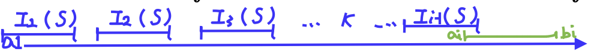

### Comparison between two EDF

Two EDF schedules with different speeds s1(t) > s2(t), for all t whenever S1 is not idle.

- 1' For any t and any job jk, the workload of jk executed by time t under S1 is always <= that under S2.

  $\rightarrow$  The rightmost point of each connected component of  $T^{≥s}$  must be a tight deadline. --- Property (2)
- 2' $\bigcup_{k=1}^{i} I_k(S1) ⊆ \bigcup_{k=1}^{i} I_k(S2)$ for any i, 1 ≤ i ≤ n.
- 3' Any job of J that can be finished under S2 is always finished strictly earlier under S1.

  $\rightarrow$ yielding no tight deadlines in $T^{<s}$. --- Property (1)
- 4' If S2 is a feasible schedule for J, then so is S1.

Refer to Lemma 3.3
$\rightarrow$ Refer to Lemma 4.3

### Algorithm Stage 1-1: s-schedule computed in O(n logn)

- The s-schedule for J contains at most 2n s-execution intervals (start, deadline endpoints)
- If the arrival times and deadlines are already sorted.
- then generating one s-execution interval costs O(log n) time
- and the entire schedule can be computed in O(n log n) time.

Refer to Lemma 3.4

- can be computed in O(n log n) time by using **a priority queue** to keep track of all jobs currently available, prioritized by deadlines.

[overall-algorithm-design](#algorithm-design)

### Algorithm Stage 1-2: Partition of jobs into 2 disjoint sets

#### Model

Given a job set J and any speed s, partition jobs by  speeds which are ≥ s and < s in the (continuous) optimal schedule of J

- $J^{≥s}$ and $J^{<s}$

s-partition of J

- < $J^{≥s}$ , $J^{<s}$ >.

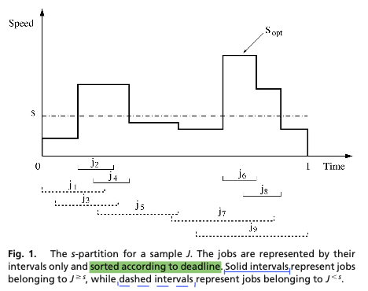

s-partition by time,

- < $T^{≥s}$ , $T^{<s}$ >
- They sum to 1.

A tight job deadline bi is that job $j_i$

- either unfinished at time bi
- or it is finished just on time at bi.

Gap

- An idle execution interval in the s-schedule

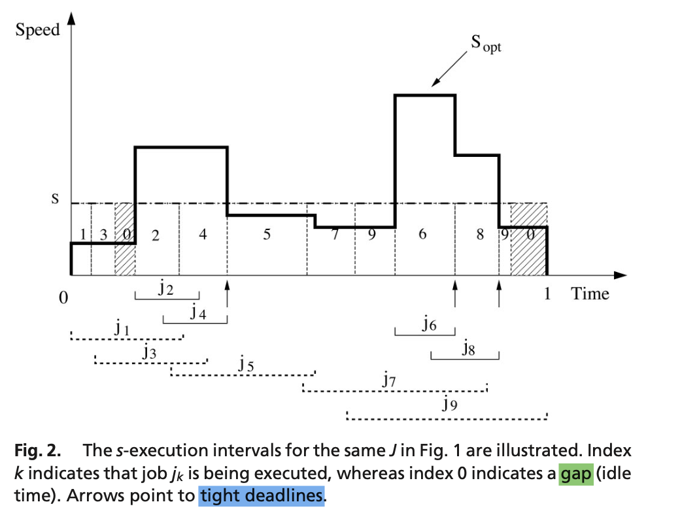

Gaps in an s-schedule can exist only in $T^{<s}$; furthermore, a gap must exist in $T^{<s}$.

Refer to Lemma 4.6. (Prove by contradiction)

#### Find the left and right boundary

Property (2-right)
Tight deadlines in an s-schedule can exist only in $T^{≥s}$.
The rightmost point of each connected component of $T^{≥s}$ must be a tight deadline.

Given above in [comparison-between-two-edf](#comparison-between-two-edf)

Property (2) gives a necessary condition for identifying the right boundary of each connected component of $T^{≥s}$.

The corresponding left boundary of such a component can also be identified through left-right symmetry of the scheduling problem with respect to time.

Property (2-left): **Symmetric Analogue** of Property (2)

Tight arrival times in an s-schedule can exist only in $T^{≥s}$.
The leftmost point of each connected component of $T^{≥s}$ must be a tight arrival time.

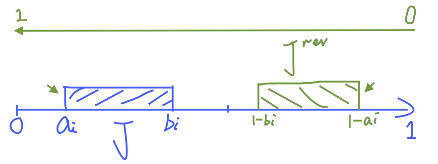

#### Gap

A gap always exists in an s-schedule if $T^{<s}$= ∅.

The expansion [b,a] of a gap [x,y] defines the connected component in $T^{<s}$ containing [x,y]

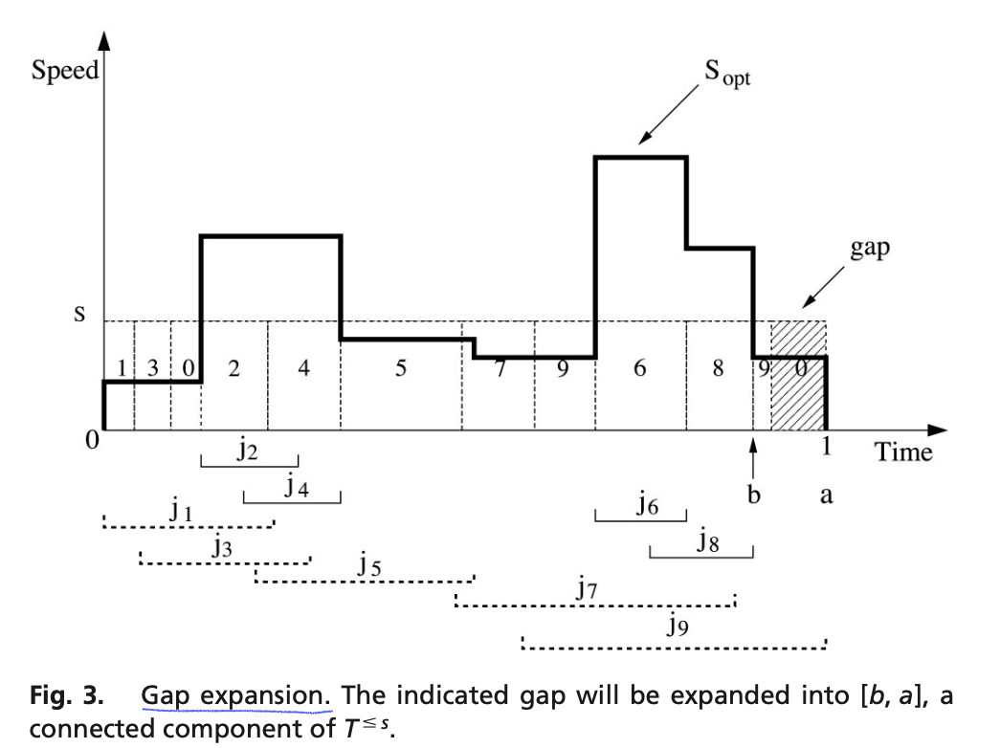

#### Algorithm Stage 1-2

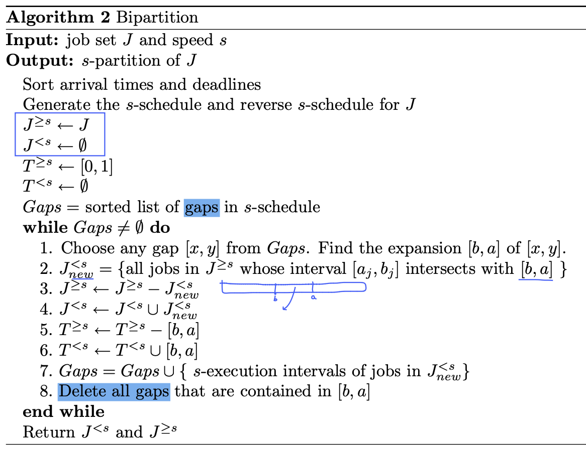

[overall-algorithm-design](#algorithm-design)

### Algorithm Stage 2: Two-level Schedule

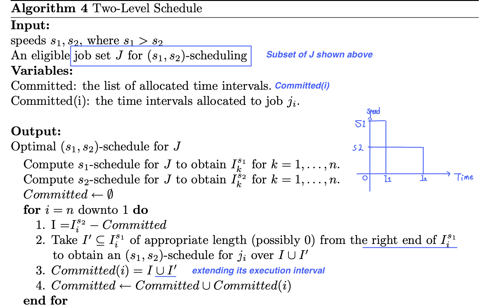

[overall-algorithm-design](#algorithm-design)

### Continuous Speed Model ( Time Complexity ⬇ )

   [SCP-AM-2005-Tsinghua_Li-Energy-DVS-Continuous-Discrete](../SCP/SCP-AM-2005-Tsinghua_Li-Energy-DVS-Continuous-Discrete.pdf): Continuous model, $O(n^2 logn)$.

M. Li, A.C. Yao, F.F. Yao, Discrete and continuous min-energy schedules for variable voltage processors, Proc. Natl. Acad. Sci. USA 103 (11) (2006) 3983–3987.

#### Algorithm

  T supporting parameter

- the union of all job intervals in J.

  Define avr(J), the ‘‘average rate’’ of J to be
- the total workload of J divided by |T| .

  We will use avr(J) as the speed threshold to perform a bipartition on J. (Unless Opt is constant function).

#### Complexity

- The process of repeated partitions can be represented by a binary tree where each internal node v corresponds to a bipartition.
- After initially sorting the job arrivals and deadlines, the cost of the bipartition at each node v is O(n log n) in the size of the subtree at v by Theorem 1.
- The sum over all internal nodes is O(P log n) where P is the total path lengths of the tree and is at most O(n^2).
- Hence, the time complexity of the algorithm is O(n^2 log n).

## Continuous Speed Model / Offline in 2014  (Time Complexity ⬇ )

  [SCP-AM-2014-Tsinghua_Li-DVS-Continuous](../SCP/SCP-AM-2014-Tsinghua_Li-DVS-Continuous.pdf): Continuous model, $O(n^2)$.

  M. Li, F.F. Yao, H. Yuan, An O(n^2) algorithm for computing optimal continuous voltage schedules, in: Proceedings of Annual Conference on Theory and Applications of Models of Computation (TAMC), 2017, pp. 389–400.

- Continuous $O(n^2)$
  The major improvement happens in the computation of s-schedules.
- Originally, the s-schedule computation is done in an online fashion where the execution time is allocated from the beginning to the end sequentially and the time assigned to a certain job can be gradually decided.
- While in this work, we allocate execution time to jobs in an offline fashion.

### Data Structure

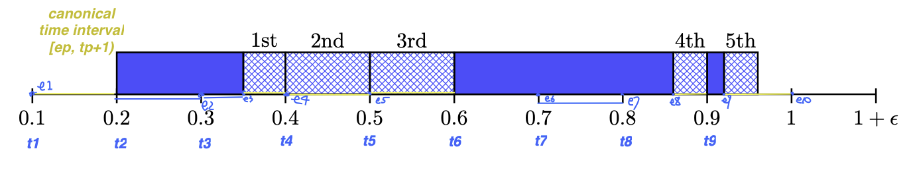

ei meaning

- the time interval [ti,ei) is fully occupied by some jobs.
- and the time interval [ei,ti+1) is idle. [canonical time interval]

### s-Schedule Algorithm in Linear Time

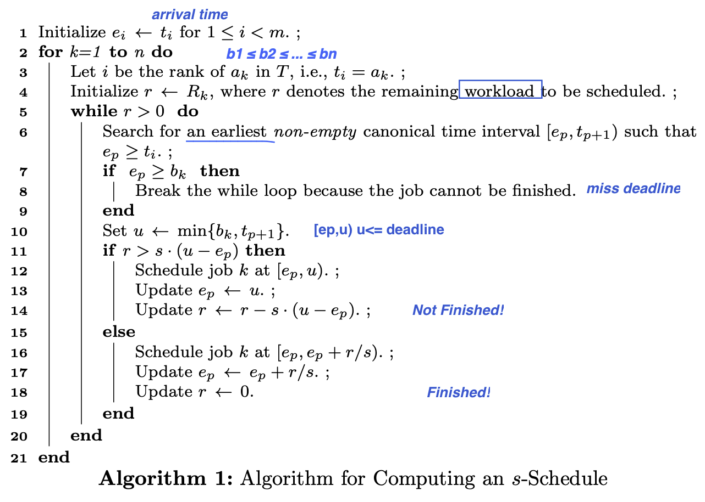

The most critical part of the algorithm is Line 6, which can be implemented efficiently by the following folklore method using a special union-find algorithm developed by Gabow and Tarjan [12] (see also the discussion of the decremental marked ancestor problem [4])

[Union-find](../Algo-Basic/Linear-Time-Special-Case-Disjoint-Set-Union-1984.pdf)
