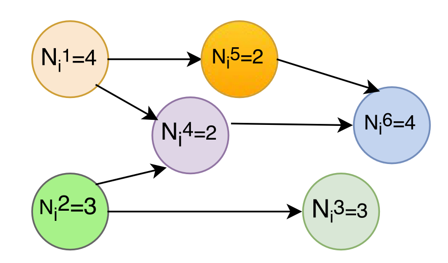
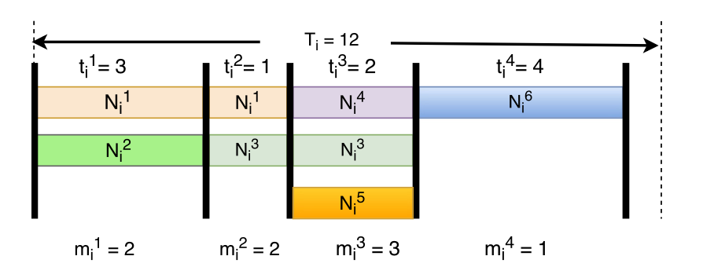
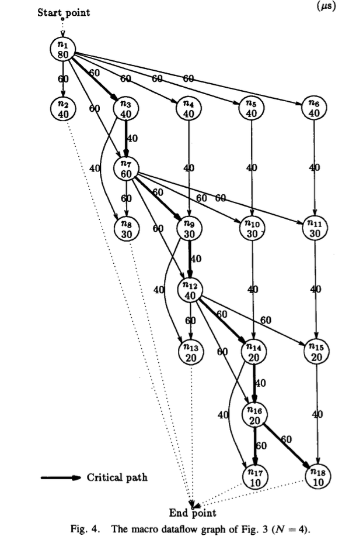
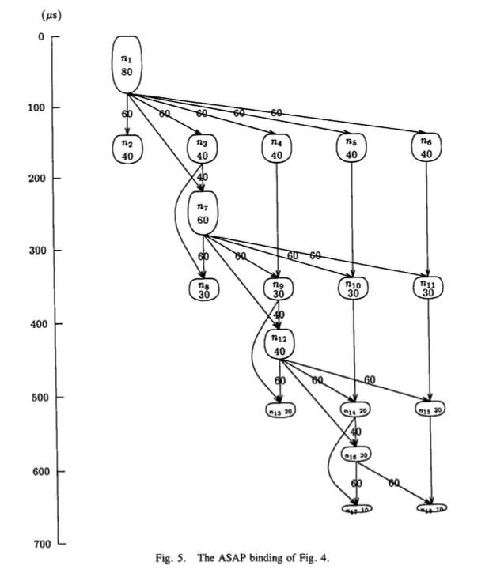

# Scheduling Literature Review (Exclude DVFS)

# Overview

Last session coves DVFS,
This session includes

1. different Task Models for CPU tasks (individual, parallel or with dependencies)
2. Scheduling algorithm (List, Federated algorithm, etc)
3. Energy Effiency in HMP (with inter/intra-Migration)
4. Consider for related factors (Temp, Resource Contentions, fairness, etc)

## Task Model

The primitives (parallel for-loops, omp task and fork/join or spawn/sync) in Parallel tasks (Cilk family, OpenMP and Intel’s Thread Building Blocks) results in intra-task parallelism structures well represented via graph-based task models.

- DAG Task
- Fork-join Task (DAG+Independent Task): Segments + Stages
  [FJ](MP-2013-Parallel_Fork-Join.pdf)
- Parallel Synchronous Task:  with extra Parallel Threads
  [PST](MP-2011-Real-Time_Sched_Generalized_Parallel_Task_Models.pdf)

## Task Decomposition (Saifullah et al. 2014)

- from DAG -> Parallel Synchronous Task -> Task with its [start, end].
- with all the dependencies (edges in the DAG) respected

## Scheduling Algorithm

- Problem notation: a | b | c

If we denote

- Machine environment

  - Pm := m Parallel and Identical machines,
  - P  := arbitrary numbers of machines.
- Job and scheduling constraints

  - pj := the time that job j takes on each machine (CPU here).
  - intree := each job has at most one successor,
  - outtree := each job has at most one predecessor.
- Objective Function

  - Cmax := the maximum of completion time of the jobs, i.e. Cmax=max(C1,C2,...Cn).
  - n := the number of processers needed

### List Scheduling : Find a Priority Function

- All tasks in DAG are assigned priority for a priority list.
- Take the first job in the list (the one with the highest priority).
- Find a machine that is available for executing this job.
  - If a machine is found, schedule this job on that machine.
  - If no suitable machine available, select the next job in the list.

#### DAG Task Model

[Hu-Algorithm](SMP-1961-USA_Hu-ParallelSequencingAssembly.pdf)  P | pj = p, intree or outtree | Longest Completion Time (Cmax) ~ Critical-Path
Whenever a machine is free for assignment, assign that ready job (i.e., the one all of whose immediate predecessors have already finished execution), which is at the highest level among all ready jobs. Ties can be broken in an arbitrary manner.

- Assign a label to each task node according to the longest path from this node to the end point.
- Near optimal, and good for a bounded number of Processing Elements.
- Weight added later for data transmission time. ( 0 for two connected tasks on a core)

[SMP-1990-DAG-MD](SMP-1990-USA_Wu-MD.pdf)  | Cmax, the number of processors needed (n) ~ Modified Critical-Path             See Section IV Scheduling

- ASAP, ALAP labels

- Generate Mobility Range(M)  [ASAP, ALAP]
  - node ni may start its execution without delaying the execution of any other node on the critical path
- Relative Mobility(Mr = M / w), where weight = time(Exec)

##### Improvement : Aggressive core assignment strategy

[SMP-DAG-Aggressive-RMS](SMP-1997-HK_Chan-RMS.pdf) Maximize utilization of available processors.
Assign task to fastest processor instead of the first one.

##### Scheduling Tasks in DAG to HMP

[HMP-DAG-1997-Extended-RMS](HMP-1998-HK_Chan-DAG-ERMS.pdf)
Extended Relative Mobility, adding normalization on speed.

### Federated Scheduling

- It allocates a dedicated cluster of cores to each high-utilization task (utilization ≥ 1)
- It executes all low-utilization tasks sequentially, on a shared cluster of the remaining cores.
- Has the best known **capacity augmentation bound of 2** for parallel tasks with implicit deadlines.
- **Capacity augmentation bound ρ**
- If scheduler S can schedule any task set τ on m cores with
  - a. the total utilization of τ is at most m/ρ
  - b. the worst-case critical path length of each task is at most 1/ρ of its deadline.

Semi-Federated : Jiang et al. (2017)

#### Energy Efficiency for DAG

[MP-2018-DAG-Energy-ImplicitDeadline](MP-2018-DAG-Energy-ImplicitDeadline.pdf)
Each DAG -> m linked lists -> m cores (with merging)

- Task Decomposition (Saifullah et al. 2014)
  - DAG task to an individual subtask with release time, deadline and execution time.
  - DVFS: Energy-efficient execution (speed) pattern

##### Migration

Intra-DAG Migration

- Merging the lightly loaded processors into a single one

  - use pairwise potential power saving
  - the Maximization of Power Saving (MPS): NP hard
  - greedy approach

Inter-DAG Migration

- Merging Processors Assigned to Different DAGs
  - Assume uniform phase difference
  - Fast algorithm using random process for speed

[MP-2019-DAG-Energy-ExplicitDeadline](MP-2019-DAG-Energy-ExplicitDeadline.pdf)
A Clustered Multi-core platform

- Processors within the same cluster run at the same speed at any given time.

Speed-profile for merged cluster

- the percentage/likelihood of all possible speeds that the task may execute at over a period
- to solve non-convex speed function

## Resource Contention

 [CAMPS] [HMP-A-2018-Spain_Garcia-Contention-CAMPS](HMP-2018-Spain_Garcia-Contention-CAMPS.pdf)

  Ref: Contention-Aware Fair Scheduling for Asymmetric Single-ISA Multicore Systems

- Even the slowdown for each thread
- bus transfer rate (BTR)
- does not require special hardware extensions or platform-specific speedup-prediction models

## Temperature

[MP-2007-Temperature_Aware_Scheduling.pdf](MP-2007-Temperature_Aware_Scheduling.pdf)

- Take into account temperature measurements achieve low and  balanced temperature profiles
- at negligible performance cost.
- Adaptive-Random policy, modifying the workload allocation policy based on the temperature history.
  - Better in eliminating hot spots than existing load balancing techniques
  - It provided significant reductions in temporal and spatial temperature variations.
  - The performance overhead of reactive techniques ( thread  migration and voltage scaling ) can be reduced dramatically when they are combined, while achieving lower and more stable temperatures.

## Appendix

[HMP-Arch-2007-Intel_Li-OS-Sched](HMP-2007-Intel_Li-OS-Schd.pdf)

both SMP-and NUMA-style performance-asymmetric architectures.

- Asymmetry-aware load balancing ∝ Computing Power
- Faster-core-first scheduling (under-utilized)
- NUMA-aware migration (consider migration cost)

[Min-Fair] [HMP-AM-2018-Korea_Kim-Fairness](HMP-2018-Korea_Kim-Fairness.pdf)

Ref:Exploring_the_Design_Space_of_Fair_Scheduling_Supports_for_Asymmetric_Multicore_Systems

Goals of fair scheduling

- First: set a certain limit in possible performance degradation by asymmetry in core capability
- Second: reduce performance variation.
- the overall throughput must be improved to exploit the performance/energy efficiency from asymmetric cores.
- Prior throughput-maximizing schedulers often sacrifice fairness of CPU provisioning excessively to gain only a small amount of extra throughput.
